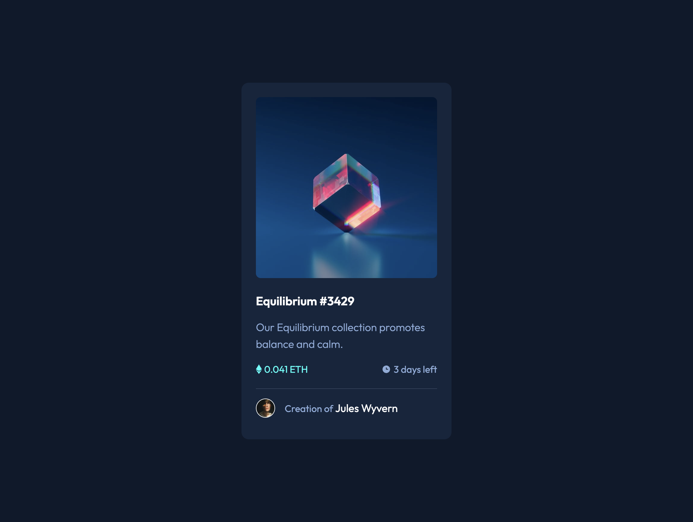

# Frontend Mentor - NFT preview card component solution

This is a solution to the [NFT preview card component challenge on Frontend Mentor](https://www.frontendmentor.io/challenges/nft-preview-card-component-SbdUL_w0U). Frontend Mentor challenges help you improve your coding skills by building realistic projects. 

## Table of contents

- [Overview](#overview)
  - [The challenge](#the-challenge)
  - [Screenshot](#screenshot)
  - [Links](#links)
- [My process](#my-process)
  - [Built with](#built-with)
  - [What I learned](#what-i-learned)
  - [Continued development](#continued-development)
  - [Useful resources](#useful-resources)
- [Author](#author)
- [Acknowledgments](#acknowledgments)

**Note: Delete this note and update the table of contents based on what sections you keep.**

## Overview

### The challenge

Users should be able to:

- View the optimal layout depending on their device's screen size
- See hover states for interactive elements

### Screenshot

### Links

- Solution URL: [Add solution URL here](https://github.com/bad-cke/nft-preview-card-component)
- Live Site URL: [Add live site URL here](https://bad-cke.github.io/nft-preview-card-component/)

## My process

### Built with

- Tailwind CSS
- Flexbox

### What I learned

First steps with tailwind CSS

### Continued development

Want to focus on mobile first styling.

### Useful resources

- [Tailwind Doku](https://tailwindcss.com/docs) - The search function is great to find the tailwind equivalent for a css atrrbute.

## Author

- Frontend Mentor - [@bad-cke](https://www.frontendmentor.io/profile/bad-cke)
